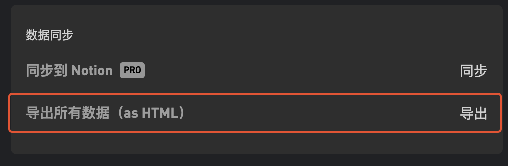
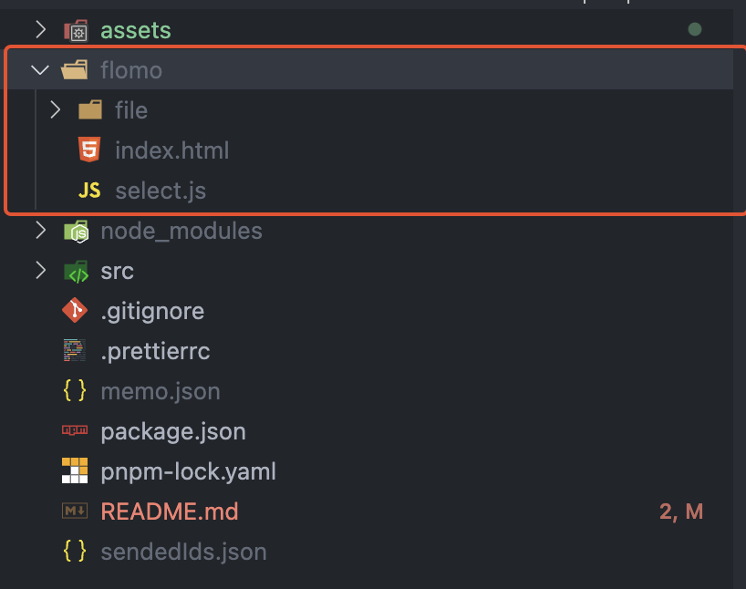
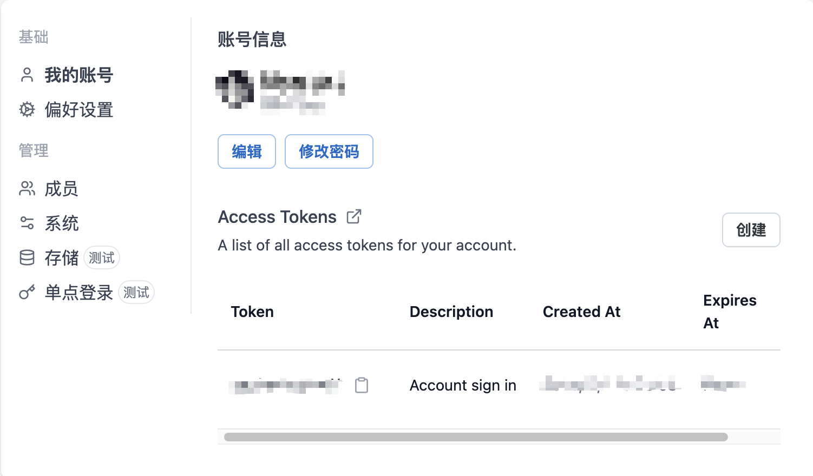
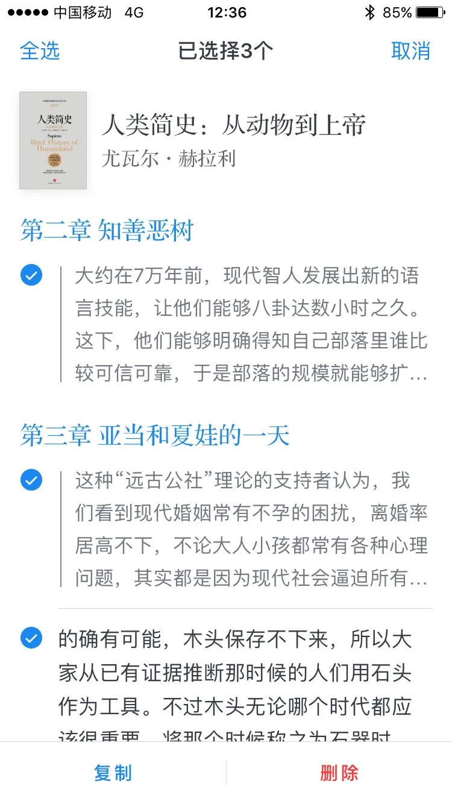

# Memos 导入数据

此项目为 [Memos](https://github.com/usememos/memos) 的数据导入工具

- 支持 flomo 的数据导入到 Memos。
- 支持 微信读书 的数据导入到 Memos。

最好使用 memo@0.10.4 以上版本，因为之前的版本不支持设置创建时间的功能。

# flomo

## 导出 flomo 数据

在 flomo 的[设置页面](https://v.flomoapp.com/mine?source=account)，点击导出 HTML 数据



## 导入到 Memos

1. 下载本项目

```bash
git clone https://github.com/JakeLaoyu/memos-import-from-flomo.git
cd memos-import-from-flomo
pnpm install
```

2. 将 flomo 导出的 HTML 文件放到本项目的目录下。如: 



3. 运行脚本

为了保证数据的顺序，上传间隔 1s。如果你的 flomo 数据量很大，可以修改 `src/utils/api.js` 中的 `SLEEP` 的值。

```bash
node ./src/main.js <your-api-host> <your-access-token> ./flomo/index.html
```
`access-token`的获取:



同步完可以打开网站查看是否符合预期。如不符合预期请看下面删除数据的方法。

## 删除同步数据

> 删除同步数据仅支持删除脚本创建的内容，创建的 tag 请手动删除，因为无法确认 tag 是否有被其他内容使用。

执行完同步数据后如果不符合预期，可以执行下面的命令删除同步的数据。删除会读取同步完成写入到 `sendedIds.json` 文件数据，所以需要保证这个文件存在。

```bash
node ./src/delete.js <your-api-host> <your-access-token>
```

# 微信读书
## 导出微信读书数据

1. 在微信读书软件中，点击“我”“笔记”，选中你要同步的书籍，例如：


2. 点击右上角“编辑”，选择你所有要同步的笔记和划线内容。然后点左下角的“复制”选项。

## 导入到 Memos

1. 下载本项目

```bash
git clone https://github.com/JakeLaoyu/memos-import-from-flomo.git
cd memos-import-from-flomo
pnpm install
```

2. copy 到项目根目录下的 `weixin.txt` 文件中。
3. 运行脚本

```bash
node ./src/weixin.js <your-api-host> <your-access-token> ./weixin.txt
```

4. 打开 Memos 查看效果，如果不满意可以删除数据。原理同 flomo 同步介绍中的一致。
   
```bash
node ./src/delete.js <your-api-host> <your-access-token>
```
